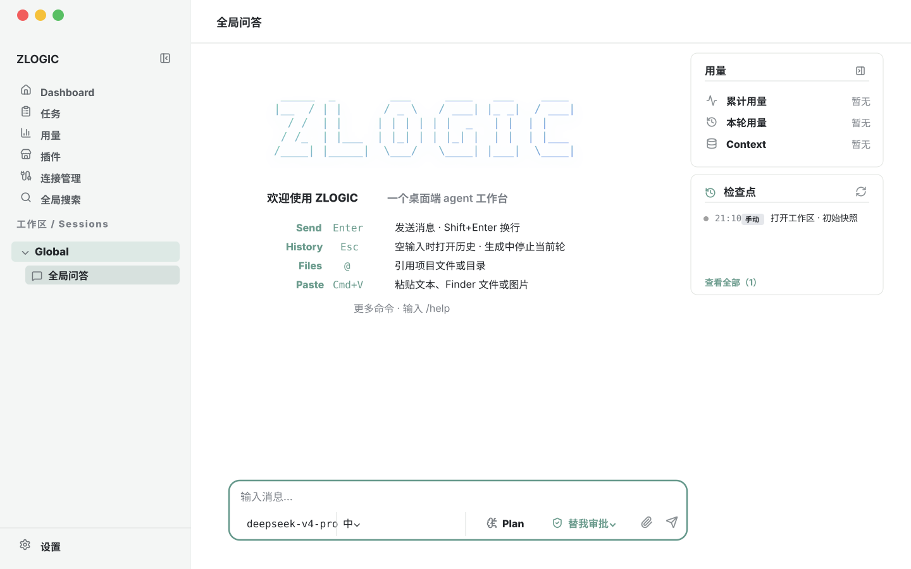
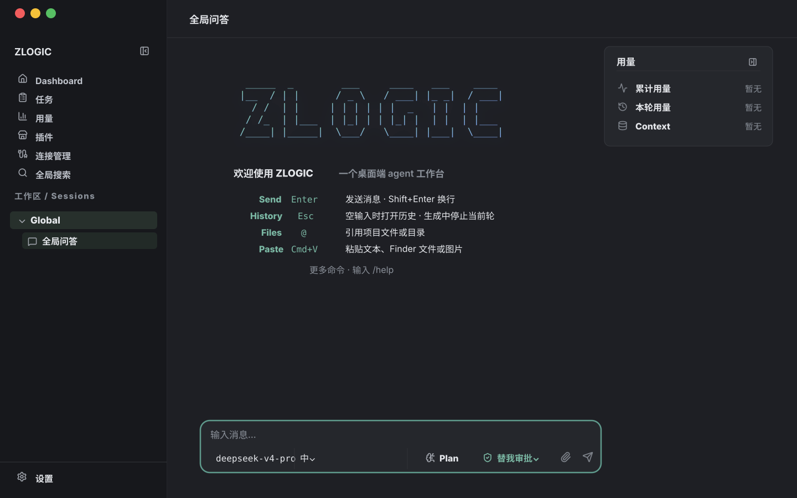

# zlogic (@zlogic.run)

> Local-first AI engineering assistant — CLI, desktop and mobile share the same
> agent runtime. No official cloud, no telemetry: requests go directly to the
> model provider you configure, and keys live only in your OS keyring — never in
> config files.

[](LICENSE)
[](https://zlogic.run)
[](https://zlogic.run/#download)
[](https://zlogic.run)

---

## Desktop preview





---

## What is zlogic

In one sentence: a **local-first AI engineering assistant**.

Once installed, it runs as a resident local agent runtime: message assembly,
context construction, tool execution, file I/O and conversation persistence all
happen on your machine; requests go only to the model providers you configure.
Drive it from the terminal TUI, or manage projects, conversations and
configuration visually in the cross-platform desktop app.

The CLI (Rust TUI), the desktop app (Tauri 2) and the planned mobile app share
one core — conversations, history and approvals move with you across clients.
They are not three products; they are **three skins over the same local
runtime**.

| Client | Form | Best for |
|---|---|---|
| **CLI (TUI)** | native full-screen terminal UI, written in Rust | people already coding, checking logs and running builds in the terminal |
| **Desktop** | Tauri 2 native app (Windows / macOS / Linux) | people who want to manage multiple projects and watch usage & cost visually |
| **Mobile (planned)** | Flutter app, paired to your machine's runtime via the daemon | approving remotely and checking sessions/tasks from your phone |

## Core features

### Privacy by default

- Keys live only in the **system keyring** (macOS Keychain / Windows Credential
  Manager / Linux Secret Service) or in environment variables — **never written
  into config files**.
- Model reasoning is shown as a separate channel and is **never fed back** into
  the next turn's context.
- Requests go straight to the endpoint you declare: OpenAI is OpenAI, DeepSeek
  is DeepSeek — no intermediary proxy layer.
- No telemetry: conversations, code, prompts, keys and usage are not collected;
  no analytics, no crash reports, no cookie tracking.

### Many providers, domestic models work out of the box

A built-in provider directory ships with the program; a provider appears
automatically once a key is detected — no config file needed:

- **Fully tested**: DeepSeek, OpenAI
- **Beta**: Anthropic, Gemini, GLM (Zhipu), DashScope (Qwen), Qwen (`qwen_local`),
  OpenRouter, Fireworks, Bedrock, and any OpenAI-compatible endpoint
  (enterprise gateways, self-hosted vLLM / SGLang)
- **Local models**: Ollama / vLLM / SGLang or any OpenAI-compatible endpoint

DeepSeek, Zhipu GLM and DashScope use their official SDKs, not a generic
compatibility layer.

### Approvals: the model may propose, but you decide

Every sensitive action (writing files, running commands, accessing external
resources) passes through the permission gate:

> **Layer 0** deterministic rules → **Layer 1** light-LLM review → **Layer 2**
> deeper model review (needs two model tiers configured) → **user confirmation**
> as the last resort

- Grant scopes: `once` / `session` / `project` — approve once and the project
  stops nagging; manage existing grants with `/grants`.
- A built-in sensitive-path list (`.env`, SSH private keys, `~/.aws`, `~/.kube`,
  `.npmrc`, …) always forces a prompt, extendable via `policy.yaml`.
- Dangerous operations (irreversible deletes, privilege escalation, releases,
  exfiltration, persistence backdoors) default to always asking a human.
- Auto-approval (Layers 0–2) cannot guarantee 100% accuracy — **user
  confirmation is the last and most important layer of the security model**.
- God Mode is only recommended for local development (desktop Settings or `/god`
  in the CLI).

### Engineering capabilities

- **Local history (checkpoints)**: shadow object-store snapshots — see what a
  turn changed, roll back, or diff-undo it. **Your git is never touched**;
  `node_modules` and similar caches are always excluded.
- **Memory**: durable facts persist across conversations, scoped
  `global` / `workspace`; project instructions always win over memory.
- **Marketplace (MCP)**: plugins & skills are MCP-based; capabilities are
  declared and approved one by one at install time, disable/uninstall anytime.
- **Connections**: databases, object storage and cloud accounts are configured
  once and authorized per workspace; credentials never enter workspace config.
- **Usage stats**: calls, tokens and cost, filterable by date / provider /
  model / workspace / conversation.

## Quick start

### One-line CLI install

```sh
# bash / zsh
curl -fsSL https://install.zlogic.run | sh

# PowerShell
irm https://install.zlogic.run | iex
```

The installer detects your OS and architecture and puts the binary in
`/usr/local/bin/zlogic` (Linux / macOS) or `%LOCALAPPDATA%\zlogic\bin`
(Windows).

### Desktop app

Download from [zlogic.run/#download](https://zlogic.run/#download):

| Platform | Format | Download |
|---|---|---|
| Windows 10/11 x64 | NSIS installer (.exe) | [download](https://zlogic.run/dl/zlogic_latest_x64-setup.exe) |
| macOS 12+ Apple Silicon | DMG | [download](https://zlogic.run/dl/zlogic_latest_aarch64.dmg) |
| macOS 12+ Intel (x86_64) | DMG | [download](https://zlogic.run/dl/zlogic_latest_x86_64.dmg) |
| Linux x86_64 | AppImage | [download](https://zlogic.run/dl/zlogic_latest_amd64.AppImage) |

System requirements: Windows needs the WebView2 runtime (included in Windows
10+); Linux needs WebKitGTK 4.1 + libsoup3. The macOS app is not yet
signed/notarized, so Gatekeeper blocks the first launch — trust it once by
running `xattr -dr com.apple.quarantine /Applications/zlogic.app` in Terminal.

**Verify your download (optional but recommended)**: every artifact ships with a
SHA-256 checksum and a minisign signature; the official machine-readable list
lives at <https://update.zlogic.run/checksums.json> (public-key fingerprint /
key id: `75AA378991532581`).

### Configure a model

Keys never enter config files — use the OS keyring or environment variables
(environment keys are on by default; just export):

```sh
export DEEPSEEK_API_KEY=sk-...
# or store it in the system keyring
zlogic key add deepseek
```

Common key commands: `zlogic key list`, `zlogic key remove <provider>`,
`zlogic key verify <provider> <model>`. You can also declare a provider
explicitly:

```yaml
# ~/.zlogic/models.yaml
providers:
  my-provider:
    sdk: openai_chat
    base_url: https://api.openai.com/v1
    models:
      gpt-4o: {}
```

### Launch the TUI

```sh
zlogic    # enter the TUI, press Enter for a new session, just talk
```

Other commands: `zlogic config` (configuration reference), `zlogic mcp`
(plugins & skills), `zlogic memory` (cross-session memory), `zlogic daemon`
(mobile pairing).

> 💡 Windows users: use **Windows Terminal / WezTerm / Alacritty / VS Code
> terminal** — the legacy cmd doesn't support DEC 2026 and has unstable IME
> composition.

## Data directories

Data is split across four roots (XDG-style on all platforms); **`data` and
`state` are the only places your local data lives — deleting them is
unrecoverable**, and only `cache` is safe to wipe:

| Root | Holds |
|---|---|
| `~/.config/zlogic/` | hand-written config: `config.yaml`, `models.yaml`, `env.yaml`, `policy.yaml` |
| `~/.local/share/zlogic/` | object store, attachments, per-workspace history, installed runtimes and skills |
| `~/.local/state/zlogic/` | `state.db` (sessions / entries / usage), locks, logs |
| `~/.cache/zlogic/` | regenerable cache, safe to delete |

Per project: `.zlogic/policy.yaml` in the project root (project policy only
tightens the global one, never loosens it) and `.mcp.json` (workspace MCP
servers). Full reference: [docs](https://zlogic.run/docs/).

## Status & roadmap

- **v1.0.0-beta.1 (Beta) released**: CLI and desktop are both downloadable.
- **Daemon**: `zlogic daemon` + `--pair` prints a one-time QR pairing key
  (valid 5 minutes) — no accounts, no cloud relay; already available in the CLI.
- **Mobile app**: planned — chat, voice calls and remote approval from your
  phone, connected to the agent runtime on your machine.
- **Open source**: currently proprietary; the source is not public. Third-party
  open-source components keep their own licenses. Ideas welcome via
  [Issue](https://github.com/zlogic-labs/zlogic/issues).

## Docs & links

- Website (downloads, docs, privacy): **https://zlogic.run**
- Docs: **https://zlogic.run/docs/** (Installation / Quick Start / Choosing CLI
  vs Desktop / Providers & Models / Key Management / Configuration Reference /
  Data Directory / Security & Approvals / Data Flow & Privacy / FAQ / Roadmap)
- Install station: **https://install.zlogic.run**
- Update station: **https://update.zlogic.run** (Tauri v2 auto-update;
  `checksums.json` verification list)
- Issues / feedback: **https://github.com/zlogic-labs/zlogic/issues**

## License

[Apache-2.0](LICENSE)
