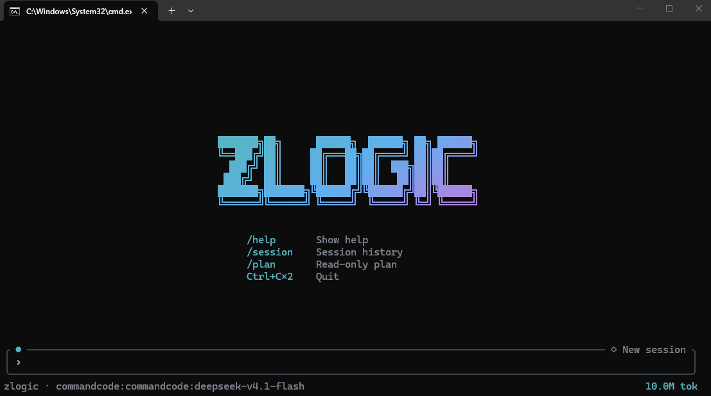

# zlogic

> **开源的 AI Agent Harness —— 用 Rust 构建的 coding agent runtime，以及驱动它的 CLI。**

**[English](README.md) · [简体中文](README.zh-CN.md)**

[](LICENSE)
[](https://zlogic.run)
[](https://zlogic.run)
[](https://zlogic.run)

## zlogic 是什么

zlogic 是一套 AI Agent Harness：一个 **agent runtime**，外加驱动它的终端客户端。

多数 coding agent 是「一个产品，里面埋着一个 runtime」。zlogic 反过来：**runtime 才是产品，客户端可以替换。**

runtime 负责构建上下文、驱动 agent 执行、调用开发环境里的工具、处理权限，并记录整个执行过程，包括 reasoning、工具调用、tokens 和花费。agent 可以直接操作文件、shell 和 Git 仓库，哪些操作可以执行，由策略控制。

CLI 是 runtime 的一个 **host**，不是 runtime 本身。桌面端、远程 daemon（`zlogic daemon`）以及你自己接的前端，都可以使用同一个 engine：相同的 `EngineApi`，相同的事件流。这样 runtime 本身可以独立开源、构建和使用，而客户端可以各自演进。见[开源范围](#开源范围)。

## 为什么是 zlogic

* **一个 runtime，多种 host。** CLI、桌面端、远程 daemon 和自定义前端使用同一个 engine。客户端负责自己的界面和交互，runtime 不需要知道它最终运行在哪里。
* **执行过程透明。** reasoning 和工具调用会实时进入 transcript；`--print json` 可以把同一轮执行输出为 JSON Lines，脚本和 CI 可以直接消费这些事件。
* **权限单独处理。** 工具只负责执行和报告结果，不负责决定自己能不能执行。请求先经过确定性规则，再进行风险审查，需要授权时交给策略和用户处理。
* **统一 provider 接口。** 不同 provider 共用一套接口，只有请求格式、streaming、thinking 或 usage 等行为存在实际差异时，才需要单独处理厂商的实现。
* **没有模型请求中转。** SQLite、YAML 配置和凭据都在本地管理，模型请求直接发送到你配置的 provider。

## 安装

### 安装 CLI

```sh
# bash / zsh
curl -fsSL https://install.zlogic.run | sh

# PowerShell
irm https://install.zlogic.run | iex
```

安装路径与各平台依赖见[安装文档](https://zlogic.run/docs/zh/01-installation.html#一行命令安装-cli-推荐)，
下载校验（SHA-256 / minisign）见[校验下载](https://zlogic.run/docs/zh/01-installation.html#校验下载-可选但推荐)。

> 💡 Windows 用户请使用 **Windows Terminal / WezTerm / Alacritty / VS Code 终端**。旧版 Windows 控制台
> 对现代终端控制序列和 IME 组合的支持不完整。

### 从源码构建

```sh
cargo build --release -p zlogic-cli    # target/release/zlogic
cargo test --workspace
```

需要 Rust 1.85+（edition 2024）。首次构建会从 crates.io 拉取依赖。不需要桌面端、GPU 或其他服务。

### 配上模型

key 不写进配置文件，可以存进系统钥匙串（或加密保险库），也可以使用环境变量：

```sh
export DEEPSEEK_API_KEY=sk-...
zlogic key set deepseek
zlogic key list
```

`zlogic key set`、`zlogic key delete <provider>` 和 `zlogic key list` 在没有配置模型时也可以使用。

## 30 秒理解 zlogic



```sh
zlogic key set deepseek                                 # 1 · key 进系统钥匙串，不进配置文件
zlogic                                                   # 2 · 进 TUI：Enter 新建会话
zlogic --prompt "执行循环在哪个文件里？"                    # 3 · 无界面单轮执行 → stdout
zlogic --prompt "总结一下这个 diff" --print json            # 4 · 同一轮，以事件 JSON Lines 输出
```

TUI 和 JSON 事件流运行的是同一套 runtime，只是使用了不同的 host 和输出方式。

TUI 中输入 `/` 可以打开命令面板，包括 `/model`、`/session`、`/replay`、`/stats`、`/approval`、`/plan` 等。
完整参数说明见 [`apps/cli/docs/cli-arguments.md`](apps/cli/docs/cli-arguments.md)。

## 架构

```text
   host ── apps/cli · 桌面端 · daemon · 你自己写的前端
     │  提交轮次、引导、回应权限请求                        ▲
     ▼                                                      │ 事件（hub）
   crates/engine ── 进程内派发层 ────────────────────────────┘
     │  打开会话与 workspace、逐轮解析模型、
     │  装配 policy / grants / memory / skills / tools、扇出事件
     ▼
   crates/core ── 一次 agent 运行：构建上下文 → round 循环 → 工具 → 落库
     │
     ├── crates/llm      LLM provider 客户端
     ├── crates/tools    工具注册表与内置工具
     ├── crates/policy   命令分解 + 路径分区 → allow / ask / deny
     ├── crates/mcp      MCP server → 同一个工具注册表里的条目
     └── crates/store    SQLite：会话、entries、用量
```

`crates/protocol` 位于这些边界之间，负责 host、engine、core 和 provider 客户端之间共享的类型。

### 分层

| 层         | 决定什么                               | 位置              |
| --------- | ---------------------------------- | --------------- |
| host      | 人看到什么：transcript、面板、审批             | `apps/cli`      |
| engine    | 哪个会话、哪个模型、哪份策略、事件发给谁               | `crates/engine` |
| core      | 一次运行：上下文、round、工具批次、落库、取消          | `crates/core`   |
| providers | 一轮如何变成 part 流                      | `crates/llm`    |
| tools     | agent 能做什么，以及回报什么                  | `crates/tools`  |
| authority | 路径、命令、工具的 `allow` / `ask` / `deny` | `crates/policy` |

这里有几个比较重要的边界：`core` 不关心使用它的是哪个 workspace 或 UI，它只拿到运行所需的 root、会话和已经解析好的模型；工具不负责权限判断；正在执行的工具通过取消请求停止，而不是直接杀掉进程。

### 这个仓库里的 crate

| 路径                | 是什么                                              |
| ----------------- | ------------------------------------------------ |
| `apps/cli`        | Ratatui TUI、渲染循环、主题、i18n、widgets，以及 `zlogic` 二进制 |
| `crates/protocol` | 各边界之间共享的类型                                       |
| `crates/engine`   | 宿主 API、服务装配和事件分发                                 |
| `crates/core`     | 构建上下文、驱动 round、执行工具、落库                           |
| `crates/llm`      | provider 客户端、请求序列化、streaming、用量归一                |
| `crates/tools`    | 工具定义、注册表与内置工具                                    |
| `crates/policy`   | shell 命令分解与路径分区                                  |
| `crates/mcp`      | MCP server、连接管理与工具目录                             |
| `crates/store`    | SQLite 持久层：会话、entries、用量                         |

其余 crate（`objects`、`credential`、`config`、`task`、`plugins`、`hooks`、`code-sitter`、`logging`、`paths`）
按目录名基本可以看懂，完整布局见仓库本身。

### 从哪开始读代码

第一遍读代码建议按这个顺序：

1. `crates/engine/src/lib.rs` —— host 能做什么，以及为什么 host 不直接调服务。
2. `crates/core/src/lib.rs` —— `Core::run`；再看 `crates/core/src/round.rs` 的执行循环，以及
   `crates/core/src/context.rs` 如何从已有 entries 构建上下文。
3. `crates/tools/src/lib.rs` —— 工具契约，以及 content / display / object 的拆分。
4. `crates/policy/src/lib.rs` —— 一条 shell 命令如何变成带路径分区的原子操作。
5. `apps/cli/src/session/engine.rs` —— 一个真实 host：bootstrap、开会话、订阅、提交。
6. `crates/protocol/src/lib.rs` —— 需要修改边界时再看。

想从小处入手？加一个工具是比较直接的入口，其次是加一个 provider 客户端。

## 开发

不需要 Node、Python 或 vendored 工具链，一个较新的 stable Rust 就够了。

```sh
cargo build --release -p zlogic-cli
cargo run -p zlogic-cli -- --prompt "hello"
cargo test --workspace
cargo fmt --all --check
cargo clippy --workspace --all-targets --locked
```

CI 在 Linux、macOS、Windows 上运行这些检查（`.github/workflows/ci.yml`）。三个平台的终端、控制台事件、系统钥匙串和剪贴板都有各自的实现，一个平台通过并不代表其他平台没有问题。

提交前的要求、改动范围与 PR 说明见 [CONTRIBUTING.md](CONTRIBUTING.md)。本仓库内的 crate 不得依赖闭源产品。

## Runtime 能做什么

* **Agent 执行循环** —— 理解任务、探索代码库、规划改动、编辑文件，并在需要时拆分给子 agent。
* **工具执行** —— 文件、搜索、shell 和 Git 都是内置工具。agent 可以直接操作仓库，也可以在独立 Git worktree 中工作。
* **基于策略的权限** —— 对文件、shell 命令、工具和外部资源进行细粒度控制。先经过确定性规则，再进行风险审查，需要授权时由策略和用户决定。授权范围包括 `once` / `session` / `project`；敏感路径（`.env`、SSH 私钥、`~/.aws`、`~/.kube`、`.npmrc` 等）默认需要询问。
* **MCP** —— stdio 或 streamable HTTP server 可以注册为和内置工具相同的工具条目，并逐项进行权限控制。
* **技能与插件** —— 支持可复用的 skill；插件通过目录和清单进行发现，可以提供 MCP server 和 skill。
* **远程执行** —— daemon 通过 HTTP JSON + SSE 暴露 engine，远程桌面端和移动端可以连接到它；使用配对建立连接，没有云端中转。
* **可观测性** —— reasoning 和工具调用实时可见；`--print json` 输出同一套事件；会话和用量保存在本地 SQLite 中，可以按日期、provider、模型和 workspace 查询。

## Providers

zlogic 使用统一的 provider 接口访问不同模型。大多数 provider 走相同的请求和事件模型；对于 API 格式、streaming、thinking、tool calling 或 usage 等行为不同的 provider，在对应客户端里处理这些差异。

目前支持 DeepSeek、OpenAI、Anthropic Claude、Google Gemini、DashScope（通义千问）、智谱 GLM、OpenRouter、xAI、Groq、AWS Bedrock，以及 OpenAI 兼容端点（vLLM、SGLang、Ollama、企业网关等）。

也可以在 `models.yaml` 中添加自己的 endpoint：

```yaml
# ~/.config/zlogic/models.yaml
providers:
  my-provider:
    sdk: openai_chat
    base_url: https://api.openai.com/v1
    models:
      gpt-4o: {}
```

当前 provider 列表见 [Provider 与模型 · 内置 provider](https://zlogic.run/docs/zh/08-providers-and-models.html#内置-provider)，
密钥存放方式见 [密钥管理 · 系统钥匙串](https://zlogic.run/docs/zh/09-key-management.html#系统钥匙串-持久化)。

## 安全与隐私

这些性质来自上面那套架构本身。

* **provider 直连** —— 模型请求由运行 agent 的机器直接发往你配置的 provider，zlogic 不提供模型请求的云端代理或中转。
* **本地存储** —— 对话历史存在设备本地的 SQLite 数据库中，可以自行查看、备份和删除，不存在 zlogic 的服务器上。
* **凭据受保护** —— API key、数据库密码、云凭据存放在操作系统凭据管理器，或由 state 目录中的主密钥加密保存，也支持环境变量。
* **凭据不进模型上下文** —— 存储的凭据不会作为对话内容或上下文暴露给模型，思考通道也不会回灌到下一轮。
* **CLI / runtime 不发送遥测** —— CLI 与 runtime 不向 zlogic 服务发送使用数据；闭源桌面端每次启动会发送一条匿名安装回执。详见[数据流与隐私 · 收集什么](https://zlogic.run/docs/zh/12-data-flow-and-privacy.html#收集什么)。

使用 AI provider 时，请同时参考对应 provider 自己的隐私政策和数据处理规则。

## 开源范围

**开源：CLI + agent runtime。** 本仓库采用 Apache-2.0，`apps/cli` 和 `crates/` 下的 crate 都可以独立构建、运行和修改。

**闭源客户端：desktop + remote daemon + additional tools。** 这些组件构建在本仓库 runtime 之上，包括桌面端、远程 daemon，以及数据库与云连接、数据分析、HTML widget、Python runtime 等工具。

发布版同时包含 OSS runtime 和这些闭源组件；从源码构建的 `zlogic` 是完整 CLI，只是不包含 daemon。

你在这里看到的 runtime，就是客户端实际使用的 runtime。runtime 和 CLI 的问题可以直接在这个仓库修复。想法与问题欢迎提 [Issue](https://github.com/zlogic-labs/zlogic/issues)。

### 桌面端

从 [zlogic.run/#download](https://zlogic.run/#download) 下载。桌面端目前只提供二进制。

| 平台                            | 格式              | 下载                                                       |
| ----------------------------- | --------------- | -------------------------------------------------------- |
| Windows 10/11 x64             | NSIS 安装包 (.exe) | [下载](https://zlogic.run/dl/zlogic_latest_x64-setup.exe)  |
| macOS 12+ Apple Silicon（M 系列） | DMG             | [下载](https://zlogic.run/dl/zlogic_latest_aarch64.dmg)    |
| macOS 12+ Intel（x86_64）       | DMG             | [下载](https://zlogic.run/dl/zlogic_latest_x86_64.dmg)     |
| Linux x86_64                  | AppImage        | [下载](https://zlogic.run/dl/zlogic_latest_amd64.AppImage) |

macOS 应用尚未签名/公证，首次打开可能会被 Gatekeeper 拦截，在终端执行
`xattr -dr com.apple.quarantine /Applications/zlogic.app` 一次性信任即可。系统依赖见
[安装文档 · 桌面端](https://zlogic.run/docs/zh/01-installation.html#桌面端-闭源)，下载校验见
[校验下载](https://zlogic.run/docs/zh/01-installation.html#校验下载-可选但推荐)。

## 数据目录

数据分四个根目录（XDG 风格）：`config` 放 `config.yaml` / `models.yaml` / `env.yaml` / `policy.yaml`，
`data` 放对象库与各 workspace 的历史，`state` 放 `state.db`、日志与凭据保险库，`cache` 可以随时清空。

**`data` 与 `state` 是本地数据的唯二存放处，删除不可恢复。**

项目级配置包括 `.zlogic/policy.yaml` 和 `.mcp.json`。前者只能收紧全局策略，后者用于声明工作区 MCP server。
实际目录布局与配置项见[配置参考 · 数据目录](https://zlogic.run/docs/zh/10-configuration.html#数据目录)。

## 项目状态

**v1.0.0-beta.1（Beta）**

CLI 与桌面端已经可用。CLI 与 agent runtime 已以 Apache-2.0 开源；远程 daemon 与桌面端目前作为闭源组件发布。

移动端目前仍在规划中。

## 文档与链接

* 官网（下载、文档）：**https://zlogic.run**
* 文档：**https://zlogic.run/docs/**
* CLI 参数说明：[`apps/cli/docs/cli-arguments.md`](apps/cli/docs/cli-arguments.md)
* 贡献指南：[CONTRIBUTING.md](CONTRIBUTING.md)
* 安装站：**https://install.zlogic.run**
* Issue / 反馈：**https://github.com/zlogic-labs/zlogic/issues**

## License

[Apache-2.0](LICENSE)。第三方开源组件保留各自许可证。
